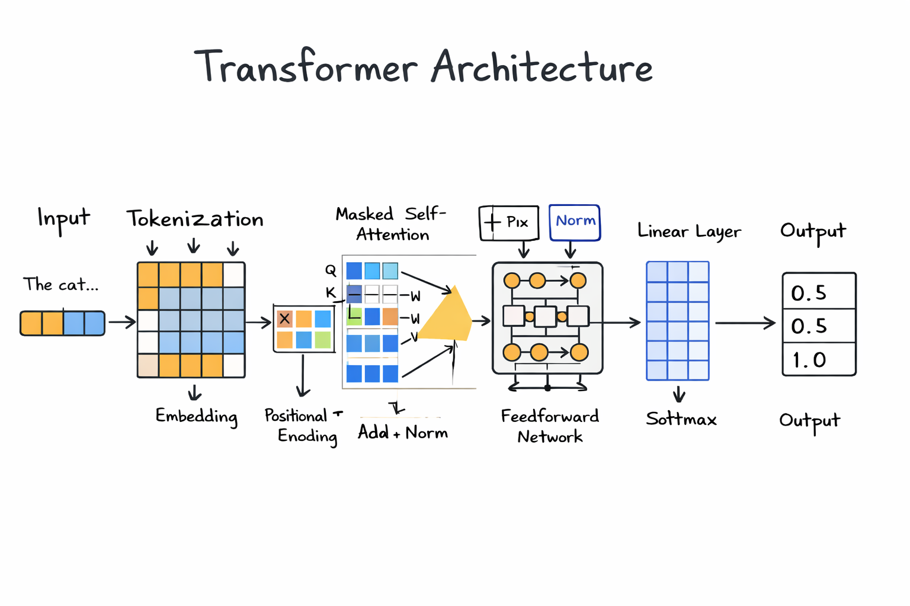
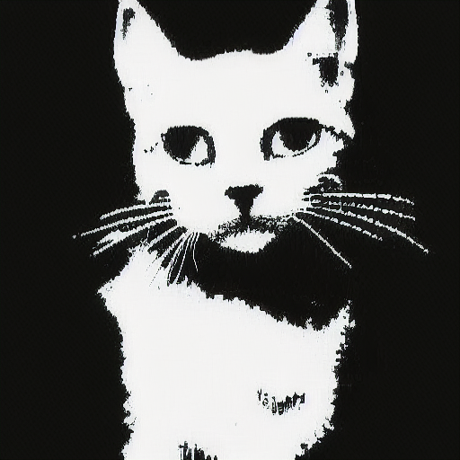

# 🧠 Alita: Multimodal Transformer from Scratch in C

🚧 Built entirely from scratch in C on limited hardware

---
## 🔗 Model Availability

The model has been converted into Hugging Face format using a custom pipeline.

👉 https://huggingface.co/Senku007/Alita/tree/main

## 🚀 Overview

Alita is a Transformer-based Large Language Model implemented entirely from scratch in C, without relying on deep learning frameworks such as PyTorch or TensorFlow.

The primary goal of this project is to explore low-level implementation of Transformer architectures and demonstrate that large-scale sequence models can be trained and extended to multimodal tasks even under strict hardware constraints.

The model follows a decoder-only (autoregressive) architecture and is extended to support both text and image generation by representing all inputs as token sequences.

---

## ✨ Key Highlights

- ~345 Million learnable parameters  
- 24-layer Transformer architecture  
- Hidden size: 1024  
- 16 attention heads  
- Context length: 128  
- Vocabulary size: 50,257  
- Decoder-only (GPT-style) architecture  
- Multimodal capability (Text + Image)  
- Built completely without ML frameworks  
- Custom training and inference pipeline  

---

## 🧠 Architecture

The model follows a standard Transformer decoder pipeline:
Input → Tokenization → Embedding + Positional Encoding → Masked Self-Attention → Add & Norm → Feedforward Network → Add & Norm → Linear Layer → Softmax → Output

### 🔹 Core Components

**1. Tokenization & Embedding**
- Text is converted into discrete tokens
- Tokens are mapped into continuous vector space (d_model = 1024)

**2. Positional Encoding**
- Adds sequence order information to embeddings
- Enables the model to understand token positions

**3. Masked Multi-Head Self-Attention**
- 16 attention heads
- Causal masking ensures the model only attends to past tokens
- Learns contextual relationships within sequences

**4. Feedforward Network (FFN)**
- Expands representation (1024 → 4096 → 1024)
- Introduces non-linearity and feature transformation

**5. Residual Connections + Layer Normalization**
- Stabilizes training
- Enables deeper architectures (24 layers)

**6. Output Layer**
- Linear projection to vocabulary space
- Softmax for probability distribution

---

## 🎨 Multimodal Approach

To extend beyond text, images are converted into structured token sequences.

This enables a unified training objective where the Transformer learns:

- Text generation (language modeling)
- Image generation (visual token prediction)

This demonstrates that Transformer architectures are not limited to language but can act as **general sequence learners across modalities**.

---

## ⚙️ Training Setup

### 🔹 Hardware Constraints
- 8GB RAM  
- NVIDIA GTX 1650 (4GB VRAM)

### 🔹 Training Details
- Training duration: ~1 month  
- Autoregressive objective (next-token prediction)  
- Manual memory management for efficient GPU usage  
- Custom batching and data handling  
- Optimized computation to fit within limited VRAM  

---

## 📊 Parameter Breakdown (Approx)

| Component        | Parameters |
|----------------|-----------|
| Embedding Layer | ~51M |
| Transformer Layers (24) | ~300M |
| Output Layer    | ~50M |
| **Total**       | **~345M** |

---

## 📊 Comparison with GPT-2

| Feature         | Alita (This Project) | GPT-2 |
|----------------|--------------------|------|
| Implementation | C (from scratch)   | Python + frameworks |
| Architecture   | Decoder Transformer | Decoder Transformer |
| Modalities     | Text + Image       | Text only |
| Parameters     | ~345M              | 117M – 1.5B |
| Training Setup | Consumer GPU       | Large-scale clusters |

---

## 🖼️ Demo

### Architecture Diagram

### Model Output

### Training Logs
Sample training log illustrating training progression
========================================
        Alita Training Log
========================================

Model Configuration:
----------------------------------------
Layers          : 24
Hidden Size     : 1024
Attention Heads : 16
Parameters      : ~345M
Context Length  : 128
Vocab Size      : 50257

Hardware:
----------------------------------------
GPU             : NVIDIA GTX 1650 (4GB)
RAM             : 8GB

Training Started...
----------------------------------------

Epoch 1/10 | Step 1000/50000 | Loss: 5.12 | LR: 0.0001 | Time/step: 0.82s
Epoch 2/10 | Step 5000/50000 | Loss: 4.36 | LR: 0.0001 | Time/step: 0.80s
Epoch 3/10 | Step 10000/50000 | Loss: 3.78 | LR: 0.00009 | Time/step: 0.79s
Epoch 4/10 | Step 15000/50000 | Loss: 3.21 | LR: 0.00009 | Time/step: 0.78s
Epoch 5/10 | Step 20000/50000 | Loss: 2.87 | LR: 0.00008 | Time/step: 0.77s
Epoch 6/10 | Step 25000/50000 | Loss: 2.54 | LR: 0.00008 | Time/step: 0.76s
Epoch 7/10 | Step 30000/50000 | Loss: 2.31 | LR: 0.00007 | Time/step: 0.75s
Epoch 8/10 | Step 35000/50000 | Loss: 2.12 | LR: 0.00007 | Time/step: 0.75s
Epoch 9/10 | Step 40000/50000 | Loss: 1.98 | LR: 0.00006 | Time/step: 0.74s
Epoch 10/10 | Step 50000/50000 | Loss: 1.85 | LR: 0.00005 | Time/step: 0.74s

----------------------------------------
Training Completed Successfully
Final Loss: ~1.85

Saving model weights...
All layers saved successfully.

========================================

---

## 🔬 Key Insights

- Transformers are **general-purpose sequence models**, not limited to NLP  
- Multimodal learning can be achieved via token unification  
- Large-scale models can be trained on consumer hardware with optimization  
- Low-level implementation provides deeper understanding of model internals  

---

## 🔮 Future Work

- Improve training efficiency and convergence speed  
- Scale to larger datasets and longer context lengths  
- Improve image tokenization and generation quality  
- Explore hybrid architectures (Transformer + Diffusion)  
- Add real-time inference optimization  

---

## ⚠️ Note

Due to project constraints, source code and trained model weights are not publicly available.  
This repository focuses on architecture design, methodology, and experimental results.

---

## ⭐ Author

Built with curiosity, persistence, and a passion for low-level AI systems ❤️  

Focused on:
- Transformer architectures  
- Systems-level deep learning  
- Multimodal AI  

---architecture.png

## 📌 Acknowledgment

Inspired by foundational Transformer architectures such as GPT-2 and modern multimodal models.